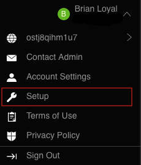
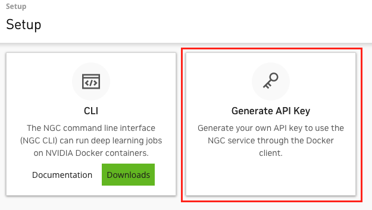

# Steps for deploying NVIDIA NIM on sagemaker
## NGC API Key Setup
If you don't already have NGC API Key, follow these steps to generate some NGC API credentials

1. Sign-in or create a new account at NVIDIA [NGC](https://ngc.nvidia.com/signin).
2. Select your name in the top-right corner of the screen and then "Setup"



3. Select "Generate API Key".



4. Select the green "+ Generate API Key" button and confirm.


5. Copy the API key - this is the last time you can retrieve it!

## Launch SageMaker notebook instance

Launch SageMaker notebook instance on `g5.xlarge` instance and git clone this repo inside that instance.

**IMPORTANT:** In Additional Configuration for **Volume Size in GB** specify at **least 300 GB**.

### 1. Pull docker container
In terminal of SageMaker notebook instance run the following commands. First we authenticate into NGC
```
# authenticate into NGC
docker login nvcr.io
# username is $oauthtoken
# password is <NGC API Key>
```
Then pull docker
```
docker pull <NIM CONTAINER>
docker tag <NIM CONTAINER> nim-<YY>.<MM>-sm
```

### 2. Tag and push container to ECR
```
cd ../
bash push_ecr.sh nim-<YY>.<MM>-sm
```

### 3. Download the prebuilt optimized model from NGC
1. Install ngc-cli

```
wget --content-disposition https://api.ngc.nvidia.com/v2/resources/nvidia/ngc-apps/ngc_cli/versions/3.39.0/zip -O ngc_cli_3.39.0.zip
unzip ngc_cli_3.39.0.zip
unzip ngccli_linux.zip
chmod u+x ngc-cli
export PATH=$PATH:ngc-cli
```

2. Set up ngc config

```
ngc config set
```

This is expected output of `ngc config set`.
```
(base) [ec2-user@ip-172-16-120-240 ~]$ ngc config set
CLI_VERSION: Latest - 3.40.0 available (current: 3.39.0). Please update by using the command 'ngc version upgrade' 
Enter API key [no-apikey]. Choices: [<VALID_APIKEY>, 'no-apikey']: <NGC_API_KEY>
Enter CLI output format type [ascii]. Choices: ['ascii', 'csv', 'json']: 
Enter org [no-org]: <ORG>
Enter team [no-team] : <TEAM>
Enter ace [no-ace] : [no-ace] 
Validating configuration...
Successfully validated configuration.
Saving configuration...
Successfully saved NGC configuration to /home/ec2-user/.ngc/config
```

3. To see the [list of all available prebuilt models](https://docs.nvidia.com/ai-enterprise/nim-llm/latest/overview.html) run the following command. Currently, **NIM supports prebuild models for A100 GPUs (`p4d.24xlarge` instance on AWS)**. Models available on NGC are TensorRT-LLM engine files which are optimized for a specific GPU type and container image version `(YY.MM)`
```
ngc registry model list "<ORG>/<TEAM>/*"
```

To make it easy to copy engine name you are interested in you can use
```
ngc registry model list "<ORG>/<TEAM>/*" --format_type csv
```

4. Then use `ngc registry model download-version` to download the prebuilt engine you are interested in. This is the expected format for the command
```
ngc registry model download-version "{Repository}:{Latest Version}"
```

where you can find the `Repository` and `Latest Version` of the model from `ngc registry model list` command

Below we show how to download **LLama-2-7B** engine which was prebuilt and optimized for running on single A100 GPU, here `Repository="<ORG>/<TEAM>/llama-2-7b-chat"`, `Latest Version="LLAMA-2-7B-CHAT-4K-FP16-1-A100.<YY>.<MM>"`
```
ngc registry model download-version "<ORG>/<TEAM>/llama-2-7b-chat:LLAMA-2-7B-CHAT-4K-FP16-1-A100.<YY>.<MM>"
```

### 4. For deploying prebuilt model on p4d.24xlarge (A100 GPU) on SageMaker
Run `nim_prebuilt_a100.ipynb` notebook to create SageMaker `p4d.24xlarge` (A100 GPU) endpoint and deploy the prebuilt model.

### 5. If you want to deploy non-prebuilt model on g5.xlarge (A10G GPU) on SageMaker
Run `nim_nonprebuilt_a10g.ipynb` notebook to optimize custom model for SageMaker `g5.xlarge` (A10G GPU) deployment.
